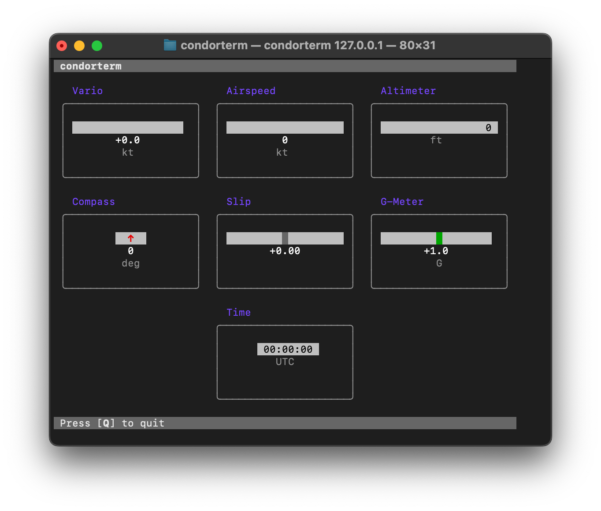

# condorterm

Terminal UI (TUI) for the [Condor](https://www.condorsoaring.com) soaring simulator.

**Warning:** This is a **work in progress**. Some features are not fully functional yet.



## Overview

`condorterm` displays Condor's UDP output in your terminal, as a set of virtual steam gauges.

This may be helpful in the following scenarios:

- **Debugging** (e.g. to check your connection to Condor from a remote machine)
- **Development** (e.g. to compare the behaviour of your custom Condor client code with `condorterm`)

You can also use it while **flying** in Condor, to display an aircraft's instrument panel on a second monitor. (The terminal offers only limited graphics, so other instrument panel solutions are normally better. However, `condorterm` may be useful if you do not have access to the alternatives.)

## Setup

Install `condorterm` from source:

```shell
cargo install
```

## Usage

Run `condorterm` and make it listen on a UDP socket:

```shell
condorterm <host> -p [port]
```

Within Condor's configuration files (`UDP.ini` and `Simkits.ini`):
- Enable Condor UDP output.
- Set the Condor UDP host and port properties to the ones you used for `condorterm`.

Start Condor (or restart Condor if it was already running).

Finally, start a new flight.

